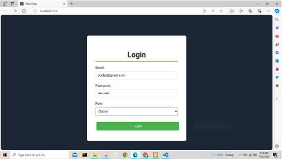

# Inventory_Management-Woodpeaker-

Problem Statement: Many of these centers struggle with inventory management due to inaccurate demand forecasting, leading to issues like stockouts and overstocking. These problems affect both customer satisfaction and operational efficiency.

Solution: Our system offers a robust solution to common inventory management problems in pharmaceutical centers. By integrating modern technology for prescription handling and inventory management, we aim to improve operational efficiency, reduce errors, and enhance customer satisfaction
 

Doctor Portal
Login Page of Doctor Portal:

Prescription Page in Doctor Page:

After writing prescription Generate QRcode:

Login Page of Medical Portal:
 

Medical Portal
Dashboard of Medical Portal:
 

View Products:
 

Searching Feature:

Data Uploading Page:	
 

 Scanning Page:
 

 Scanned data is displaying:
 
 
 Available Data is displayed:
 

 Bill Generated:
 

 History of Bills:
 

 Orders Page:
 